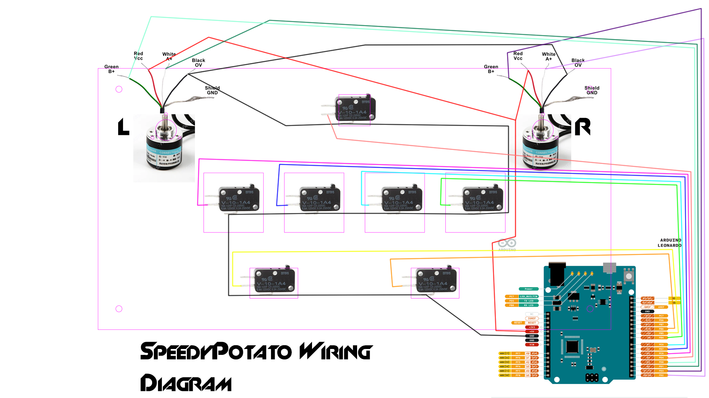

If you're here for alternate pocket SDVX firmware, flash the one in the 2E10B10LED_sdvx folder.

# basic instructions
1. download this repo and open 2E10B10LED_sdvx with arduino ide.  click the checkmark to see if it compiles and fix any missing library issues.
2. setup https://github.com/veroxzik/arduino-konami-spoof
3. wire it up
4. plug in the board, update line 22 to your encoder's PPR (const int PULSE = 24;  //number of pulses per revolution of encoders) and click the upload button

wiring diagram

# RhythmCodes
DIY製作多種音樂遊戲控制器的程式碼,使用Arduino Leonardo

# Todo list:
* implement debounce library
* librarylize HID light code
* mixed light mode
* eeprom function to keep user settings
